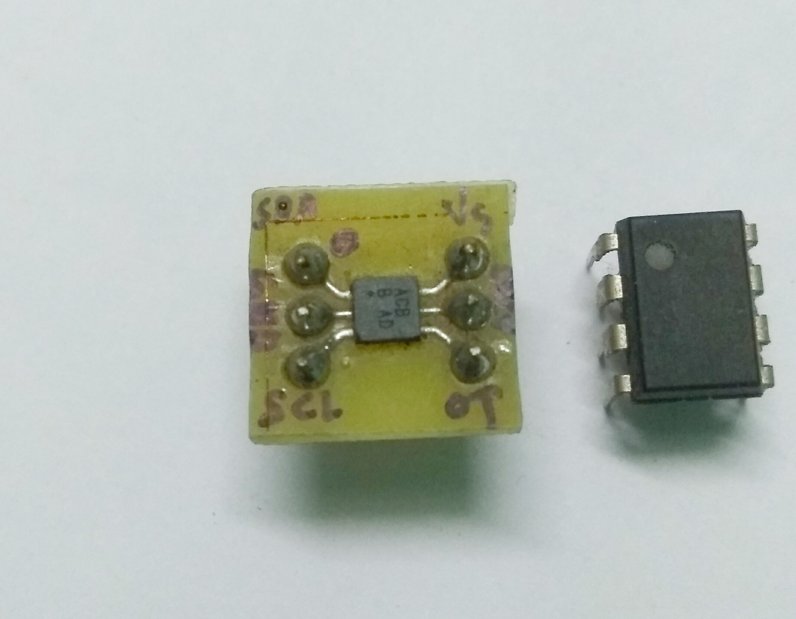

# MAX6626_library
The MAX6626 combines a temperature sensor, a programmable overtemperature alarm, a dedicated alarm output, OT, activates if the conversion exceeds the value programmed in the high-temperature register. This library can be used to work with all the features the sensor provides.

Please refer to the datasheet [here](extras/MAX6625-MAX6626.pdf) for further information.

## Pinout and Application Circuit

  

## Test Breakout
The DIP-8 component is for size reference.

  

Test PCB of MAX6626

